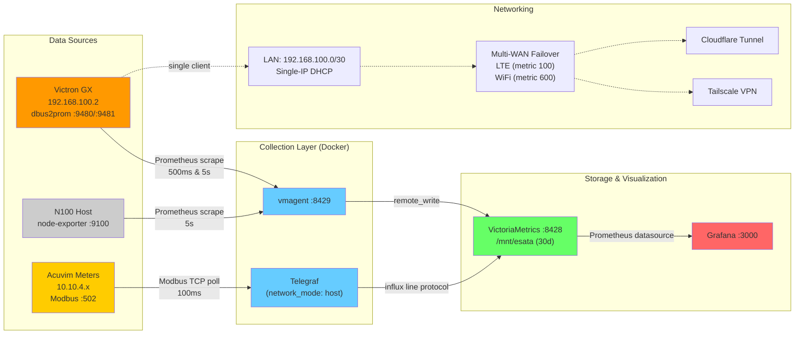

# Architecture Diagram Prompt for Image Generation

## For AI Image Models (DALL-E, Midjourney, etc.)

```
Create a technical architecture diagram for an industrial telemetry system with these components:

TOP SECTION - DATA SOURCES (left to right):
1. Box labeled "Victron GX Device" (Venus OS logo style) at IP 192.168.100.2
   - Contains: "dbus2prom.py" service
   - Two ports: ":9480 (500ms)" and ":9481 (5s)"
   - Use orange/blue colors

2. Box labeled "Acuvim Power Meters" (multiple meters)
   - Show 2-3 meter icons
   - Label: "Modbus TCP :502"
   - IPs: "10.10.4.x"
   - Use yellow/black industrial colors

3. Box labeled "N100 Host System"
   - Contains: "node-exporter :9100"
   - Show as a mini-PC hardware icon
   - Use gray/silver colors

MIDDLE SECTION - COLLECTION LAYER:
1. Box labeled "vmagent"
   - Port: :8429
   - Arrow from Victron showing "Prometheus scrape"
   - Arrow from node-exporter

2. Box labeled "Telegraf"
   - Tag: "network_mode: host"
   - Arrow from Acuvim meters showing "Modbus TCP poll"
   - Label arrow: "InfluxDB line protocol"

BOTTOM SECTION - STORAGE & VISUALIZATION:
1. Large box labeled "VictoriaMetrics"
   - Port: :8428
   - Show database cylinder icon
   - Arrows from vmagent (labeled "remote_write") and Telegraf (labeled "influx endpoint")
   - Storage: "/mnt/esata (30d retention)"
   - Use green colors

2. Box labeled "Grafana"
   - Port: :3000
   - Arrow from VictoriaMetrics (labeled "Prometheus datasource")
   - Show dashboard icon
   - Use orange/red colors

RIGHT SIDE - NETWORKING:
1. Small box labeled "LAN: 192.168.100.0/30"
   - Single-IP DHCP
   - dnsmasq + nftables NAT

2. Box showing "Multi-WAN Failover"
   - "LTE Router (metric 100)" - primary
   - "USB Wi-Fi (metric 600)" - fallback
   - NetworkManager icon

3. Cloud icons labeled:
   - "Cloudflare Tunnel" (cloudflared)
   - "Tailscale VPN"

VISUAL STYLE:
- Use clean, technical diagram style (similar to AWS/GCP architecture diagrams)
- Color-coded data flows: metrics in green, config in blue, status in orange
- Solid arrows for data flow, dashed for network connections
- Include port numbers on all connections
- Add small latency labels (500ms, 5s, 1s) near arrows
- Container boundaries shown with dotted boxes
- Use monospace font for technical labels
- White/light gray background
- Professional engineering diagram aesthetic

LAYOUT:
- Horizontal layout with clear left-to-right data flow
- Group Docker containers in a shaded region
- Show external services (Cloudflare/Tailscale) outside main flow
- All components clearly labeled with service names and ports
```

## For Diagram Tools (draw.io, Lucidchart, etc.)

If using a manual diagramming tool, here's the structure:

### Layer 1: Data Sources
```
┌─────────────────┐  ┌─────────────────┐  ┌─────────────┐
│ Victron GX      │  │ Acuvim Meters   │  │ N100 System │
│ 192.168.100.2   │  │ 10.10.4.x       │  │             │
│                 │  │                 │  │             │
│ dbus2prom.py    │  │ [Meter Icons]   │  │ node-exp    │
│ :9480 :9481     │  │ Modbus :502     │  │ :9100       │
└────────┬────────┘  └────────┬────────┘  └──────┬──────┘
         │                    │                   │
         │ Prometheus         │ Modbus TCP        │ Prometheus
         │ scrape             │ poll              │ scrape
         ▼                    ▼                   ▼
```

### Layer 2: Collection
```
    ┌─────────────────────────────────────────────┐
    │           Docker Containers                 │
    │  ┌──────────┐              ┌──────────┐   │
    │  │ vmagent  │              │ Telegraf │   │
    │  │ :8429    │              │ (host)   │   │
    │  └────┬─────┘              └────┬─────┘   │
    │       │ remote_write            │ influx  │
    │       └──────────┬──────────────┘         │
    │                  ▼                         │
```

### Layer 3: Storage & Viz
```
    │       ┌──────────────────┐                │
    │       │ VictoriaMetrics  │                │
    │       │ :8428            │                │
    │       │ /mnt/esata       │                │
    │       └────────┬─────────┘                │
    │                │                           │
    │                ▼ datasource                │
    │       ┌──────────────────┐                │
    │       │ Grafana :3000    │                │
    │       │ [Dashboards]     │                │
    │       └──────────────────┘                │
    └─────────────────────────────────────────────┘
```

### Side: Networking
```
┌────────────────────┐
│ LAN: 192.168.100/30│
│ Single-IP DHCP     │
│ NAT + forwarding   │
└──────────┬─────────┘
           │
      ┌────┴─────┐
      │Multi-WAN │
      │Failover  │
      ├──────────┤
      │LTE (100) │
      │WiFi(600) │
      └────┬─────┘
           │
    ┌──────┴──────┐
    │   Internet  │
    │             │
    │ Cloudflare  │
    │ Tailscale   │
    └─────────────┘
```

## Mermaid Diagram (for Markdown rendering)



## Quick ASCII Art Version

```
         Data Sources              Collection           Storage         Viz
    
    ┌──────────────┐              ┌──────────┐       ┌──────────┐   ┌─────────┐
    │ Victron GX   │─scrape 500ms→│ vmagent  │──────→│Victoria  │──→│ Grafana │
    │ :9480/:9481  │              │  :8429   │remote │ Metrics  │ DS│  :3000  │
    └──────────────┘              └──────────┘write  │  :8428   │   └─────────┘
                                                      └──────────┘
    ┌──────────────┐              ┌──────────┐           ↑
    │ Acuvim       │─Modbus TCP──→│ Telegraf │───────────┘
    │ Meters       │  poll 100ms  │  (host)  │  influx
    └──────────────┘              └──────────┘
    
    ┌──────────────┐              ┌──────────┐
    │ node-exp     │─scrape 5s───→│ vmagent  │
    │ :9100        │              │          │
    └──────────────┘              └──────────┘
    
         LAN: 192.168.100.0/30 (GX)
              ↓ NAT
         Multi-WAN: LTE + WiFi
              ↓
         Cloudflare / Tailscale
```

Copy any of these prompts/formats to create your diagram!
